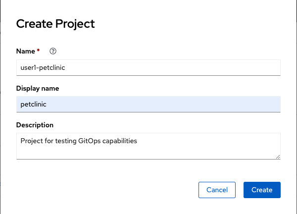
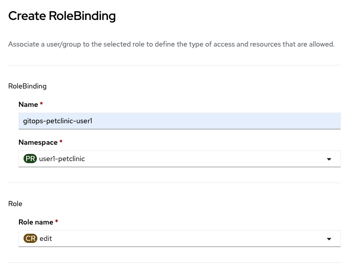

# Prepare the project to GitOps

## Prepare the OpenShift project to deploy the application

The application to deploy on Openshift will be stored on a project called petclinc. In this case, the administrator must be build the project and add the respective permission to ArgoCD user.

### Create the project petclinc

In the Home Menu, select projects option

Then, select Create Project in the top-right side

Use petclinic in the name and display name. *Note:* The name must be on lower case and only use (-) simbol

### Grant access to petclinic project 

Go to RoleBindings section on *User Management* Menu

The create a new RoleBonding, in order to grant *edit* access to openshift-gitops-argocd-application-controller Service Account to Petclinic namespace.

Create the Role Binding with the next data:
* Binding Type: Namespace Role Binding
* Name: petclinic-gitops-userXY
* Namespace: userXY-petclinic
* Role: edit
* Subject: Service Account
* Subject Namespace: userXY
* Subject Name: openshift-gitops-argocd-application-controller

The RoleBinding is created and GitOps get access to modify the components on the project

[Go to content](content.md)
[Go to readme](../README.md)
